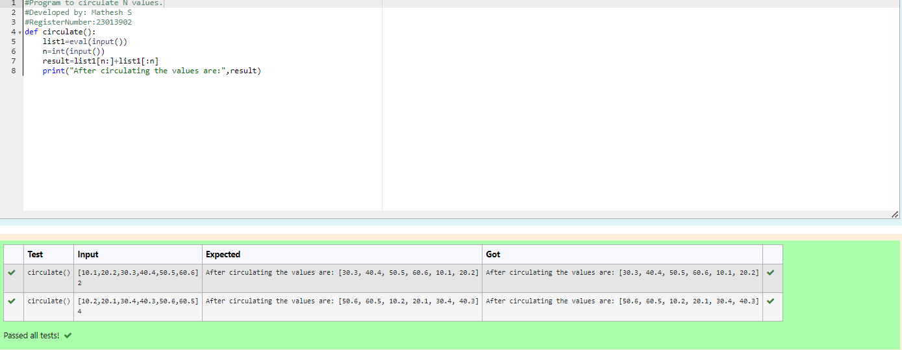

# Circulate-the-values-of-N-variables
## Aim:
To write a python program to circulate the n variables using function concept
## Equipment’s required:
PC
Anaconda - Python 3.7
## Algorithm: 

### Step 1: 
Start the program

### Step 2: 
get the value from the user the number of rotation

### Step 3: 
Get the value from the user for the number of rotation

### Step 4: 
Using the slicing concept rotate the list

### Step 5: 
Evaluate the input

### Step 6: 
Enter a integer(n) in input

## Program:
```
#Program to circulate N values.
#Developed by: Mathesh S
#RegisterNumber:23013902
def circulate():
    list1=eval(input())
    n=int(input())
    result=list1[n:]+list1[:n]
    print("After circulating the values are:",result)
```
## Output:


## Result:
Thus the circulate n variables was succesfully executed
